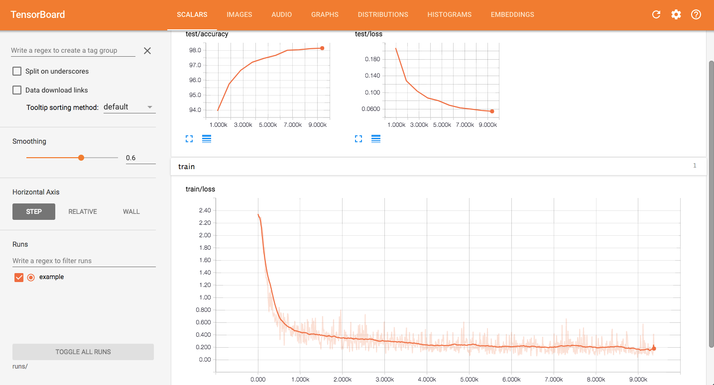

# Example to use TensorBoard from Pytorch 

How to use TensorBoard from Pytorch with MNIST example. 

[tensorboardX](https://github.com/lanpa/tensorboard-pytorch) module, a TensorBoard extension for PyTorch, is used for this.

## Usage

```bash
pip install -r requirements.txt
python main.py
```

```bash
# In another terminal, 
tensorboard --logdir runs

# Then open localhost:6006 in your browser, and you will see something like the screenshots below.
```

## Screenshots

### Loss and accuracy



### Model architecture


